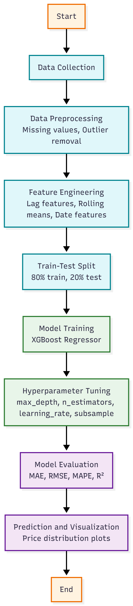
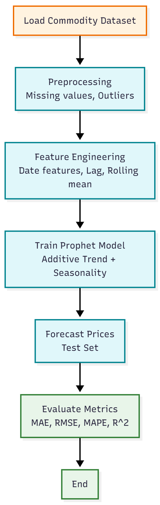
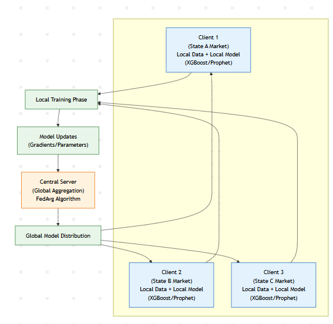

# AI-Powered Crop Price Forecasting using XGBoost, Prophet & Federated Learning

> An end-to-end machine learning system for forecasting agricultural commodity prices using historical market data, combining XGBoost, Prophet, and Federated Learning with a Flask REST API. This repository represents my implementation and contributions to a collaborative machine learning project focused on agricultural price forecasting.


---

# 📖 Overview

Agricultural commodity prices are highly volatile due to seasonal variations, supply-demand imbalances, weather conditions, transportation constraints, and government policies.

This project presents an end-to-end AI-powered crop price forecasting system that combines XGBoost, Prophet, and Federated Learning to predict agricultural commodity prices using historical market data from data.gov.in.

Unlike traditional forecasting approaches, the system automatically performs feature engineering and supports decentralized model training through Federated Learning, allowing multiple regional datasets to collaboratively improve prediction performance while preserving data privacy.

---

## 📊 Dataset

Source: data.gov.in

Coverage:
- January 2018 – December 2024
- Multiple Indian states
- Agricultural commodities including:
  - Wheat
  - Onion
  - Rice
  - Pulses

The dataset was cleaned, preprocessed, and aggregated to ensure temporal consistency before model training.

---

# ✨ Key Features

- AI-powered crop price prediction
- XGBoost regression model
- Prophet time-series forecasting
- Federated Learning implementation
- Automated feature engineering
- Historical trend analysis
- RESTful Flask API
- JSON-based prediction responses
- Modular machine learning pipeline
- Robust input validation

---

# 🏗 System Architecture

### XGBoost Workflow

<p align="center">
  
</p>

---

### Prophet Workflow

<p align="center">
  
</p>

---

### Federated Learning Workflow

<p align="center">
  
</p>
---

## 🤖 Model Configuration

### XGBoost

- Max Depth: 6
- Estimators: 500
- Learning Rate: 0.05
- Subsample: 0.8

### Prophet

- Automatic trend detection
- Weekly seasonality
- Yearly seasonality

### Federated Learning

- Federated Averaging (FedAvg)
- Multiple regional clients
- Privacy-preserving distributed training

---

# ⚙️ Feature Engineering

The backend automatically generates predictive features including:

- 1-day lag price
- 7-day lag price
- 30-day lag price
- 7-day moving average
- 30-day moving average
- Historical minimum price
- Historical maximum price
- Month
- Week of year
- Day of week
- Encoded categorical variables

These engineered features significantly improve prediction performance without increasing user input complexity.

---

# 🛠️ Tech Stack

| Category | Technologies |
|----------|--------------|
| Programming Language | Python |
| Machine Learning | XGBoost |
| Time Series Forecasting | Prophet |
| Federated Learning | Flower |
| Backend | Flask |
| Data Processing | Pandas, NumPy |
| Model Serialization | Pickle |
| API Testing | cURL, Python |


---

# 📈 Prediction Workflow

1. User submits crop details through the API.
2. Input is validated.
3. Historical data is retrieved.
4. Feature engineering is performed automatically.
5. Machine learning models generate predictions.
6. Predicted crop price is returned as a JSON response.

---

# 📊 Model Performance

| Model | Purpose |
|--------|----------|
| XGBoost | Regression-based crop price prediction |
| Prophet | Seasonal and trend forecasting |
| Federated Learning | Privacy-preserving collaborative learning |

## Results

| Model | MAE | RMSE | R² |
|------|------:|------:|------:|
| XGBoost | 82.64 | 225.20 | 0.9473 |
| Prophet | 79.70 | 188.02 | 0.9630 |

## Federated Learning Performance

| Round | Global MAE | Global RMSE |
|------|------:|------:|
| 1 | 112.84 | 289.61 |
| 2 | 97.52 | 256.37 |
| 3 | 89.76 | 236.25 |

---
## Installation

1. **Install Dependencies**:
   ```bash
   pip install -r requirements.txt
   ```

2. **Ensure Model Files are Present**:
   Make sure these files are in the same directory as `app.py`:
   - `xgboost_model.pkl` - Trained XGBoost model
   - `label_encoders.pkl` - Label encoders for categorical variables
   - `dataset (1).csv` - Historical data for feature engineering

## Usage

### Starting the API Server

```bash
python app.py
```

The server will start on `http://localhost:5001`

### API Endpoints

#### 1. Health Check
```
GET /health
```
Returns the health status of the API and whether models are loaded.

#### 2. Sample Input Format
```
GET /sample
```
Returns a sample input format for the prediction endpoint.

#### 3. Price Prediction
```
POST /predict
```

**Request Body** (JSON):
```json
{
    "state": "Karnataka",
    "district": "Kalburgi",
    "market": "Kalburgi",
    "commodity": "Wheat",
    "date": "2024-12-01"
}
```

**Response** (JSON):
```json
{
    "success": true,
    "input": {
        "state": "Karnataka",
        "district": "Kalburgi",
        "market": "Kalburgi",
        "commodity": "Wheat",
        "date": "2024-12-01"
    },
    "predicted_price": 2150.75,
    "currency": "INR"
}
```

### Input Requirements

- **state**: State name (string)
- **district**: District name (string)
- **market**: Market name (string)
- **commodity**: Commodity name (string)
- **date**: Date in format 'YYYY-MM-DD' or 'DD/MM/YYYY' (string)

### Backend Calculations

The API automatically calculates these features in the backend:
- **Lag Prices**: 1-day, 7-day, and 30-day lag prices
- **Moving Averages**: 7-day and 30-day moving averages
- **Min/Max Prices**: Historical minimum and maximum prices
- **Date Features**: Year, month, day, day of week, week of year
- **Encoded Categories**: Label-encoded categorical variables

## Testing

Run the test script to verify the API is working:

```bash
python test_api.py
```

This will test all endpoints with sample data.

### Manual Testing with curl

```bash
# Health check
curl http://localhost:5001/health

# Sample format
curl http://localhost:5001/sample

# Make prediction
curl -X POST http://localhost:5001/predict \
  -H "Content-Type: application/json" \
  -d '{
    "state": "Karnataka",
    "district": "Kalburgi", 
    "market": "Kalburgi",
    "commodity": "Wheat",
    "date": "2024-12-01"
  }'
```

## Sample Inputs

Here are some sample inputs you can try:

### Example 1: Wheat in Karnataka
```json
{
    "state": "Karnataka",
    "district": "Kalburgi",
    "market": "Kalburgi",
    "commodity": "Wheat",
    "date": "2024-12-01"
}
```

### Example 2: Tomato in Maharashtra
```json
{
    "state": "Maharashtra", 
    "district": "Pune",
    "market": "Pune",
    "commodity": "Tomato",
    "date": "2024-12-15"
}
```

### Example 3: Rice in Punjab
```json
{
    "state": "Punjab",
    "district": "Ludhiana",
    "market": "Ludhiana", 
    "commodity": "Rice",
    "date": "01/01/2025"
}
```

## Error Handling

The API provides detailed error messages for:
- Missing required fields
- Invalid date formats
- Unknown state/district/market/commodity combinations
- Model loading issues
- Internal server errors


## Notes

- The API uses historical data to calculate features, so predictions are based on past trends
- If no historical data is found for a specific combination, it falls back to dataset averages
- All prices are in Indian Rupees (INR)
- The model was trained on agricultural market data and works best with known state/district/market/commodity combinations
